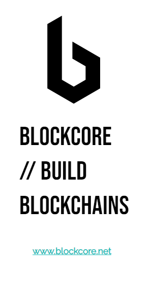
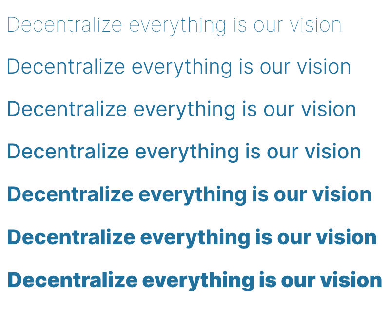

### Blockcore Brand Book

**Blockcore** is a cutting-edge open-source platform created by a community of passionate blockchain developers and engineers with a vision to decentralize the digital world. Blockcore offers a robust, fully integrated suite of tools that empower developers to create custom blockchains and decentralized applications. The platform includes essential software such as blockchain nodes, explorers, indexers, non-custodial wallets for desktop, mobile, and web, decentralized web nodes, decentralized identifiers (DIDs), and more.

With Blockcore, building a new blockchain is straightforward, whether you're forking existing code or utilizing Blockcore's blockchain templates. The platform is designed to be flexible, scalable, and secure, making it an ideal choice for developers looking to innovate within the blockchain space.

At the heart of Blockcore’s mission is the belief in the power of decentralization. We aim to create the foundational building blocks for modern, decentralized societies, where individuals have full control over their digital lives without reliance on traditional centralized systems. Whether you're looking to create a free city, an intentional community, or modernize existing systems, Blockcore's tools are here to help you build a better future.

Our platform is not just a collection of tools; it’s a community-driven project where free individuals collaborate to realize a future without borders or jurisdictions. Blockcore is open, transparent, and continuously evolving with contributions from developers around the world, ensuring that it remains at the forefront of blockchain innovation.

---

## Table of Contents
1. [Brand Overview](#1-brand-overview)
   - 1.1 [Brand Mission](#11-brand-mission)
   - 1.2 [Brand Vision](#12-brand-vision)
   - 1.3 [Brand Values](#13-brand-values)
2. [Brand Identity](#2-brand-identity)
   - 2.1 [Brand Name](#21-brand-name)
   - 2.2 [Logos](#22-logos)
   - 2.3 [Icons](#23-icons)
   - 2.4 [Banners](#24-banners)
   - 2.5 [Color Palette](#25-color-palette)
   - 2.6 [Typography](#26-typography)
3. [Brand Voice and Messaging](#3-brand-voice-and-messaging)
   - 3.1 [Tone of Voice](#31-tone-of-voice)
   - 3.2 [Key Messages](#32-key-messages)
   - 3.3 [Content Guidelines](#33-content-guidelines)
4. [Brand Applications](#4-brand-applications)
   - 4.1 [Website](#41-website)
   - 4.2 [Marketing Materials](#42-marketing-materials)
   - 4.3 [Social Media](#43-social-media)
   - 4.4 [Swag and Merchandise](#44-swag-and-merchandise)
5. [Legal and Compliance](#5-legal-and-compliance)
   - 5.1 [Trademark Usage](#51-trademark-usage)
   - 5.2 [Privacy Policy](#52-privacy-policy)
6. [Community Engagement](#6-community-engagement)
   - 6.1 [Open Source Contribution](#61-open-source-contribution)
   - 6.2 [Events and Meetups](#62-events-and-meetups)
7. [Appendix](#7-appendix)
   - 7.1 [Contact Information](#71-contact-information)
   - 7.2 [References](#72-references)

---

## 1. Brand Overview

### 1.1 Brand Mission
**Blockcore's mission** is to empower developers and communities by providing robust, open-source software tools that enable the creation of decentralized systems. We strive to enhance privacy, security, and autonomy through the development of custom blockchains and decentralized applications. Our commitment is to decentralize everything, offering the tools and infrastructure needed to eliminate reliance on centralized systems.

### 1.2 Brand Vision
**Blockcore's vision** is to be the foundational technology that powers the decentralized world of the future. We envision a world where decentralized technologies are the backbone of modern societies, making traditional centralized systems unnecessary and obsolete. Our goal is to enable the creation of free cities, intentional communities, and the modernization of existing systems through decentralization.

### 1.3 Brand Values
- 🛠️ **Open Source:** We believe in the power of community-driven development and transparency. All our tools are open-source, allowing for collaboration and innovation across the globe.
- 🌐 **Decentralization:** Our core philosophy is to eliminate centralized control, giving power back to individuals. We are committed to building technologies that support decentralized governance and decision-making.
- 🚀 **Innovation:** We constantly push the boundaries of technology, exploring new ways to build a better, decentralized future. Innovation is at the heart of everything we do, driving us to create solutions that are both scalable and secure.
- 🤝 **Community:** Building and nurturing a strong, collaborative community of developers and users is essential to our success. We value the contributions of our community and strive to create an inclusive environment where everyone can participate.

---

## 2. Brand Identity

### 2.1 Brand Name
**Blockcore**

### 2.2 Logos
The Blockcore logos are available in both dark and light versions, suitable for various backgrounds and applications. Below are the available logo files:

#### Vector Logos
- 
- 

#### Raster Logos
**Dark Versions**
- 
- 
- 
**Light Versions**
- 
- 
- 

### 2.3 Icons
Blockcore icons are available in multiple formats and sizes. The icons come in dark and light versions, ensuring they look great on any background.

#### Original Icons
- 
- 

#### Square Icons
- 
- 

#### Favicons
- 

### 2.4 Banners
For promotional use, we provide Blockcore banners in standard web sizes:

- **Horizontal Banner (728x90):**
  - 
- **Vertical Banner (300x600):**
  - 

### 2.5 Color Palette
The Blockcore color palette is designed to reflect the modern and innovative nature of the brand.

#### Primary Colors
-  **Dark Gray:** `#272932`
-  **Teal Green:** `#22a59d`
-  **Medium Blue:** `#22719d`

#### Secondary Colors
-  **Light Gray:** `#d8d6cd`
-  **Gradient:** Teal Green to Medium Blue

### 2.6 Typography
Blockcore uses the Inter font family for all digital and print materials.

#### Available Fonts
- **Inter Regular:**
  - [Inter Regular Font](assets/fonts/Inter-VariableFont_opsz,wght.ttf)

- **Inter Italic:**
  - [Inter Italic Font](assets/fonts/Inter-Italic-VariableFont_opsz,wght.ttf)

#### Typography Example

---

## 3. Brand Voice and Messaging

### 3.1 Tone of Voice
Blockcore’s tone of voice is professional, authoritative, and forward-thinking. We communicate with clarity and precision, focusing on the benefits of decentralization and open-source technology.

### 3.2 Key Messages
- **Primary Message:** "Empowering developers to build the decentralized future."
- **Secondary Messages:**
  - "Your tools for creating custom blockchains."
  - "Open-source software for a decentralized world."
  - "Join the movement towards decentralization."

### 3.3 Content Guidelines
- **Website Content:** Should be concise, informative, and aligned with our mission of decentralization.
- **Social Media:** Engage the community with updates, open discussions, and educational content. Use a conversational tone while maintaining professionalism.
- **Documentation:** Clear, detailed, and technically accurate to assist developers in using Blockcore tools effectively.

---

## 4. Brand Applications

### 4.1 Website
- **Design Guidelines:** Consistent use of brand colors, typography, and imagery. Navigation should be intuitive, with a focus on user experience.
- **Content Structure:** The homepage should highlight key products (Node, Wallet, Explorer, etc.), with clear calls to action.
- **Tone:** Professional, with a focus on decentralization and community.

### 4.2 Marketing Materials
- **Brochures:** Consistent use of the Blockcore visual identity, with clear messaging focused on the benefits of the platform.
- **Presentations:** Use branded templates with the Blockcore color palette, typography, and logo.

### 4.3 Social Media
- **Platforms:** Focus on platforms where developers and blockchain enthusiasts are active.
  - **[X](https://x.com/blockcoredev)**
  - **[GitHub](https://github.com/block-core)**
  - **[Discord](https://www.blockcore.net/discord)**
  - **[YouTube](https://www.youtube.com/@blockcoredev)**
- **Content Strategy:** Regular updates on development progress, community contributions, and educational posts about decentralization.

### 4.4 Swag and Merchandise
- **Design:** Use the Blockcore logo, colors, and tagline on merchandise like t-shirts, stickers, and mugs.
- **Quality:** Ensure that all merchandise is of high quality, reflecting the professionalism of the Blockcore brand.

---

## 5. Legal and Compliance

### 5.1 Trademark Usage
- **Guidelines:** The Blockcore trademark should be used according to the brand guidelines to maintain consistency and protect the brand's integrity. Always ensure that the trademark is clearly visible, and do not alter it in any way.
- **Licensing:** Blockcore is committed to open-source principles. Our software is licensed under permissive open-source licenses, allowing developers to use, modify, and distribute the software freely. However, any use of the Blockcore brand or logo in conjunction with other projects must adhere to the trademark usage guidelines.

### 5.2 Privacy Policy
- **Overview:** Blockcore takes privacy seriously. We do not collect personal information unless it is necessary for providing our services. Any data we collect is handled with care and in compliance with data protection regulations.
- **Compliance:** Blockcore ensures compliance with all relevant data protection laws, including GDPR, to protect the privacy of our users. We are transparent about our data practices and provide clear guidelines on how we handle and store data.

---

## 6. Community Engagement

### 6.1 Open Source Contribution
- **Guidelines:** Blockcore is built by a community of developers from around the world. We welcome contributions from anyone interested in advancing decentralized technologies. Contributors should adhere to the coding standards and documentation practices outlined in our [GitHub repository](https://github.com/block-core).
- **Recognition:** We recognize and celebrate the contributions of our community members. Contributors are acknowledged in our documentation and releases, and significant contributions may be highlighted in our blog or social media channels.

### 6.2 Events and Meetups
- **Participation:** Blockcore actively participates in blockchain conferences, meetups, and other industry events. These events provide an opportunity to connect with the community, share knowledge, and promote decentralized technologies.
- **Sponsorship:** Blockcore is open to sponsoring relevant events that align with our mission and values. We believe in supporting initiatives that advance decentralization and open-source development.

---

## 7. Appendix

### 7.1 Contact Information
For any inquiries or support, please contact us through the following channels:
- **Email:** post@blockcore.net
- **Website:** [Blockcore](https://www.blockcore.net)
- **GitHub:** [block-core](https://github.com/block-core)
- **X:** [@blockcoredev](https://twitter.com/blockcoredev)
- **Discord:** [Blockcore Community](https://www.blockcore.net/discord)

### 7.2 References
- **Documentation:** [Blockcore Documentation](https://docs.blockcore.net)
- **Explorer:** [Blockcore Explorer](https://explorer.blockcore.net)
- **Wallet:** [Blockcore Wallet](https://wallet.blockcore.net)
- **Tools:** Access to design assets, templates, and other resources is available through our documentation and GitHub repository.

 